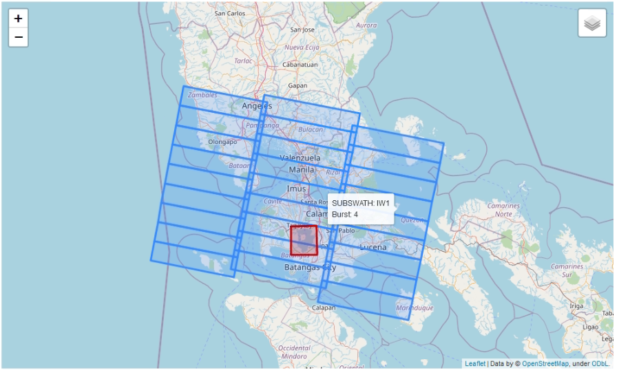

# S-1 TOPS SPLIT Analyzer (STSA)

[](https://travis-ci.com/pbrotoisworo/s1-tops-split-analyzer) [](https://codecov.io/gh/pbrotoisworo/s1-tops-split-analyzer) [](https://www.python.org/downloads/release/python-360/)


This code intends to help users easily work with the S-1 TOPS SPLIT function in [SNAP software](https://step.esa.int/main/download/snap-download/) by parsing the XML metadata of Sentinel-1 satellite data and converting it into usable data such as shapefiles or webmaps.

Using S-1 TOPS SPLIT Analyzer you are able to:
* Download XML data directly from [Copernicus Scihub](https://scihub.copernicus.eu/) and view TOPS-SPLIT data. No need to download the full 4 GB image to view the TOPS SPLIT data
* View TOPS-SPLIT data from downloaded ZIP files containing full size Sentinel-1 imagery
* View all subswaths at the same time
* Save S1-TOPS-SPLIT data as a shapefile, JSON, or CSV
* View and interact with S1-TOPS-SPLIT data using a webmap. In addition, you can add a polygon to visualize its extent with regards to the S1-TOPS-SPLIT data

Comments and feedback are welcome.

# Installation

This has been tested to work in Python versions 3.6 to 3.9

**If you are using Windows you need to manually install the [GDAL](https://www.lfd.uci.edu/~gohlke/pythonlibs/#gdal) and [Fiona](https://www.lfd.uci.edu/~gohlke/pythonlibs/#fiona) wheels OR install Fiona using Anaconda**:

`conda install -c conda-forge fiona`

Linux or MacOS users can disregard the previous instruction. Install stsa into your environment by opening the terminal in the repo root folder and typing this command:

`pip install .`

# Usage
STSA can be used in the command line and as a Python import.

## Command Line
CLI access is available if you directly run `stsa.py`. The available flags are:

| Flag      | Description                 |
| --------  |:---------------------------:|
| -v        | Print all statements        |
| --zip     | Path of Sentinel-1 ZIP file |
| --swaths  | List of target subswaths    |
| --polar   | Polarization                |
| --shp     | Path of output shapefile    |
| --csv     | Path of output CSV file     |
| --json    | Path of output JSON file    |
| --api-user | Copernicus username |
| --api-password | Copernicus password |
| --api-scene | Sentinel-1 scene ID to download |
| --api-folder | Folder for downloaded XML files |

Below is a sample command where user selects subswath IW2 and IW3, specifies VV polarization, and specifies output data.

```bash
python stsa.py --zip S1_image.zip --swaths iw2 iw3 --polar vv --shp out_shp.shp --csv out_csv.csv --json out_json.json
```

## Python Import

Below is a sample of using `TopsSplitAnalyzer` to create a shapefile and visualize on a webmap. To visualize on a webmap you need to be using Jupyter Notebook.

```python
# Create object
import stsa

s1 = stsa.TopsSplitAnalyzer(target_subswaths=['iw1', 'iw2', 'iw3'], polarization='vh')
s1.load_Data(zip_path='S1_image.zip')

# Write to shapefile
s1.to_shapefile('data.shp')

# Get JSON
s1.to_json('json_output.json')

# Write to CSV
s1.to_csv('output.csv')

# Visualize on a webmap with additional polygon
s1.visualize_webmap(polygon='mask.shp')
```

<p align="center">
  
  <br>
  Output shown on a webmap
</p>

# Tests

If you plan on contributing ensure that is passes all tests by installing `pytest` and typing this in the project directory:

`pytest tests`
